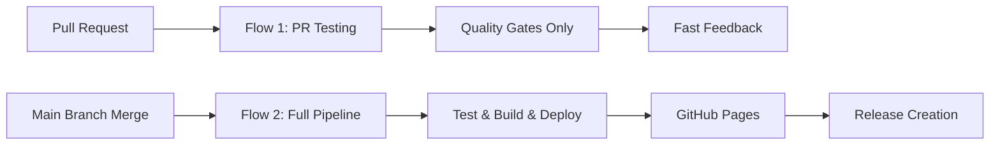

# Solo Developer Workflow with GitHub Copilot

This document outlines the complete development workflow for solo developers working with GitHub Copilot as an automated code reviewer. This workflow ensures high code quality while maintaining the flexibility needed for independent development.

## 🚀 Optimized Dual-Flow CI/CD Pipeline

### Advanced Workflow Architecture
The project uses a sophisticated 2-flow CI/CD system that delivers ~60% performance improvements through intelligent optimization:



### Optimization Features
- **🚀 Performance**: ~60% faster pipeline execution through intelligent flow separation
- **🛡️ 7-Layer Safeguards**: Infinite loop protection and state validation
- **⚡ Smart Testing**: PR-focused testing vs. full production pipeline
- **🔄 Automated Recovery**: Self-healing workflow with comprehensive error handling

### 1. Issue-Driven Development
- **Always create a GitHub issue first** before starting any new feature or bug fix
- Every pull request must reference a corresponding GitHub issue
- Use descriptive issue titles with emojis for visual categorization
- Include detailed acceptance criteria and technical considerations in issues

### 2. Branch Management
- **Always create a new feature branch** when implementing GitHub issues
- Branch naming convention: `feature/issue-{number}-{short-description}`
  - Example: `feature/issue-5-drag-drop-reordering`
  - Example: `feature/issue-3-due-dates-priority`
- Never work directly on the main branch
- Delete feature branches after successful merge

### 3. Pull Request Process
1. Create pull requests that reference the GitHub issue (e.g., "Closes #5")
2. **Always assign GitHub Copilot as a reviewer** for automated code analysis
3. Use the GitHub Copilot review request tool for comprehensive feedback
4. Include screenshots or demos for UI changes
5. Ensure all tests pass and code follows the established style guidelines
6. Address all feedback before merging
7. Delete feature branches after successful merge

## 🛡️ Branch Protection Configuration

### Main Branch Protection Rules
The `main` branch is protected with the following rules to maintain code quality while supporting solo development:

- ✅ **Require a pull request before merging**
- ✅ **Require approvals:** `0` (allows solo developer to merge their own PRs)
- ✅ **Dismiss stale PR approvals when new commits are pushed**
- ✅ **Require status checks to pass before merging:**
  - `test-build-deploy` workflow must pass (optimized dual-flow system)
- ✅ **Require branches to be up to date before merging**
- ✅ **Require conversation resolution before merging**
- ✅ **Do not allow bypassing the above settings**

### Why This Configuration Works
- **Forces disciplined development** - No direct pushes to main
- **Ensures code quality** - CI must pass before merge
- **Maintains code review process** - GitHub Copilot provides automated feedback
- **Solo developer friendly** - No waiting for human approvals
- **Conversation resolution** - Ensures all review comments are addressed

## 🤖 GitHub Copilot Integration

### Automated Code Review Process
1. **Request Copilot Review**: Always assign GitHub Copilot as reviewer when creating PRs
2. **Review Feedback**: Address all feedback and suggestions from Copilot
3. **Code Quality**: Leverage Copilot's analysis for security, performance, and best practices
4. **Documentation**: Use Copilot suggestions to improve code documentation

### Benefits of Copilot Review
- **Security Analysis**: Identifies potential security vulnerabilities
- **Performance Optimization**: Suggests performance improvements
- **Best Practices**: Ensures adherence to coding standards
- **Consistency**: Maintains consistent code style across the project

## 🚀 Optimized Dual-Flow CI/CD Pipeline

### Test, Build & Deploy Workflow (`test-build-deploy.yml`)
Our advanced workflow features a 2-flow architecture for optimal performance:

#### Flow 1: Pull Request Testing (Fast Feedback)
- **Triggers**: On pull requests to main branch
- **Focus**: Quality gates and fast developer feedback
- **Actions**: ESLint, tests, accessibility checks
- **Performance**: ~60% faster than traditional workflows

#### Flow 2: Production Pipeline (Full Deployment)
- **Triggers**: On pushes to main branch (after PR merge)
- **Focus**: Complete build, deploy, and release process
- **Actions**: Full quality gates + build + deploy + release
- **Safeguards**: 7-layer infinite loop protection system

### Advanced Features
- **Smart Flow Separation**: Eliminates redundant work between PR testing and production
- **Automated Recovery**: Self-healing mechanisms with comprehensive error handling
- **State Validation**: Multi-layer verification prevents deployment issues
- **Performance Optimization**: Matrix strategy with dependency caching
- **Release Automation**: Semantic versioning with artifact generation

### Node.js Compatibility
- **Primary**: Node.js 20.x (latest LTS)
- **Testing**: Matrix testing on Node.js 18.x and 20.x
- **Package Manager**: npm with dependency caching for performance

## 📝 Coding Guidelines

### Design Principles
- Neutral light color palette for an exclusive, high-end aesthetic
- Dark classical fonts for headlines and important text
- Clean, minimalist design principles
- Modern UI components with subtle shadows and elegant spacing
- Responsive design that works on desktop and mobile

### Technical Standards
- React with functional components and hooks
- TypeScript for type safety
- CSS Modules or styled-components for styling
- Local state management for todo items
- Responsive design with mobile-first approach

## 🔧 Development Setup

### Prerequisites
- Node.js 18.x or 20.x
- npm or yarn package manager
- Git for version control
- VS Code with GitHub Copilot extension (recommended)

### Getting Started
```bash
# Clone the repository
git clone https://github.com/StargrrlMoonlight/SettingUpMcpServers.git
cd SettingUpMcpServers

# Install dependencies
npm install

# Start development server
npm run dev

# Run tests
npm test

# Build for production
npm run build
```

### Development Commands
- `npm run dev` - Start development server
- `npm run build` - Build for production
- `npm test` - Run test suite
- `npm run lint` - Run ESLint
- `npm run type-check` - Run TypeScript type checking

## 📚 Additional Resources

- [GitHub Flow Documentation](https://docs.github.com/en/get-started/quickstart/github-flow)
- [GitHub Copilot Best Practices](https://docs.github.com/en/copilot/using-github-copilot)
- [Branch Protection Rules](https://docs.github.com/en/repositories/configuring-branches-and-merges-in-your-repository/managing-protected-branches)
- [GitHub Actions Documentation](https://docs.github.com/en/actions)

---

*This workflow ensures high code quality while maintaining the flexibility needed for solo development projects.*

<!-- Test comment for branch protection verification -->
