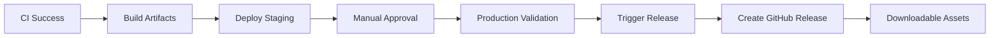

# Deployment & Release Guide

This document covers the deployment processes, artifact management, and release workflows for the React Todo List project.

## 🚀 Deployment Pipeline

### Overview


### Deployment Environments

**Staging Environment**
- **URL**: [https://stargrrlmoonlight.github.io/SettingUpMcpServers](https://stargrrlmoonlight.github.io/SettingUpMcpServers)
- **Purpose**: Automatic deployment for testing and validation
- **Trigger**: Automatic after successful CI on main branch
- **Artifact**: `staging-build` + `staging-pages`

**Production Environment**
- **Purpose**: Manual approval gate and release preparation
- **Trigger**: Manual approval after staging deployment
- **Artifact**: `production-build`
- **Action**: Triggers automatic release creation

## 📦 Artifact Management

### Build Artifacts

**staging-build**
- **Purpose**: Staging deployment on GitHub Pages
- **Retention**: 1 day
- **Contents**: Complete application build for staging validation

**production-build**
- **Purpose**: Production validation and release assets
- **Retention**: 1 day
- **Contents**: Production-ready application build

**staging-pages**
- **Purpose**: GitHub Pages specific deployment artifact
- **Retention**: GitHub Pages managed
- **Contents**: Optimized pages deployment package

### Build Process
```bash
# Install dependencies
npm ci

# Build for production
npm run build

# Output directory
dist/
├── index.html
├── assets/
│   ├── index-[hash].js
│   ├── index-[hash].css
│   └── react-[hash].svg
└── vite.svg
```

## 🏗️ GitHub Pages Deployment

### Configuration
- **Source**: GitHub Actions deployment
- **Branch**: Deployed from `main` branch artifacts
- **Custom Domain**: Not configured (using GitHub Pages default)
- **HTTPS**: Enforced by GitHub Pages

### Deployment Process
1. **Build Stage**: Creates application artifacts
2. **Pages Setup**: Configures GitHub Pages environment
3. **Artifact Upload**: Uploads `staging-pages` artifact
4. **Pages Deploy**: Deploys to GitHub Pages infrastructure
5. **Health Check**: Validates deployment success

### Health Checks
```bash
# Basic availability check
curl -f -s "https://stargrrlmoonlight.github.io/SettingUpMcpServers"

# Response time validation
curl -w "@curl-format.txt" -o /dev/null -s "https://stargrrlmoonlight.github.io/SettingUpMcpServers"
```

## 🏷️ Release Management

### Automated Releases

**Trigger Conditions**
- Production deployment approval
- Successful staging validation
- All CI/CD quality gates passed

**Version Calculation**
- **First Release**: v1.0.0
- **Major Bump**: `BREAKING CHANGE` or `feat!` commits
- **Minor Bump**: `feat` or `feature` commits  
- **Patch Bump**: All other commits (`fix`, `docs`, `style`, etc.)

**Release Assets**
- **Source Code**: Automatic GitHub archive (.tar.gz, .zip)
- **Built Application**: Production build artifacts
- **Changelog**: Auto-generated from conventional commits

### Manual Releases

**Workflow Dispatch**
- **Trigger**: Manual from GitHub Actions UI
- **Inputs**: Custom version, prerelease flag, release notes
- **Use Cases**: Hotfixes, custom versions, pre-releases

**Release Creation Process**
1. **Version Validation**: Ensures version doesn't already exist
2. **Changelog Generation**: Creates changelog from git history
3. **Asset Preparation**: Packages release artifacts
4. **GitHub Release**: Creates formal GitHub release
5. **Notification**: Updates release status

## 🔧 Local Development Deployment

### Development Server
```bash
# Start development server
npm run dev

# Available at: http://localhost:5173
# Features:
# - Hot module replacement
# - Real-time error overlay
# - Source map support
# - API proxy (if configured)
```

### Production Preview
```bash
# Build for production
npm run build

# Preview production build
npm run preview

# Available at: http://localhost:4173
# Features:
# - Production build testing
# - Service worker testing
# - Performance validation
```

### Build Analysis
```bash
# Analyze bundle size
npm run build -- --mode=analyze

# Manual bundle analysis
npx vite-bundle-analyzer dist
```

## 🛠️ Environment Configuration

### Build Variables
```bash
# Production build optimizations
NODE_ENV=production

# Source map generation
GENERATE_SOURCEMAP=true

# Build output directory
BUILD_PATH=dist
```

### Deployment Variables
```yaml
# GitHub Actions environment variables
GITHUB_TOKEN: ${{ secrets.GITHUB_TOKEN }}
NODE_VERSION: "20.x"
DEPLOYMENT_ENVIRONMENT: staging|production
```

## 🔒 Security Considerations

### Content Security Policy
```html
<!-- Implemented in index.html -->
<meta http-equiv="Content-Security-Policy" 
      content="default-src 'self'; script-src 'self' 'unsafe-inline';">
```

### HTTPS Enforcement
- **GitHub Pages**: Automatic HTTPS enforcement
- **Development**: Not enforced (localhost only)
- **Preview**: Not enforced (localhost only)

### Dependency Security
```bash
# Audit dependencies
npm audit

# Fix vulnerabilities
npm audit fix

# Check for outdated packages
npm outdated
```

## 📊 Deployment Monitoring

### Health Checks
- **Automatic**: Performed after each deployment
- **Validation**: HTTP status codes, response times
- **Accessibility**: Basic a11y validation
- **Performance**: Core Web Vitals monitoring

### Error Tracking
- **Browser Console**: Development error tracking
- **Build Errors**: CI/CD pipeline monitoring
- **Deployment Failures**: GitHub Actions notifications

### Performance Monitoring
```javascript
// Core Web Vitals (built into application)
import { getCLS, getFID, getFCP, getLCP, getTTFB } from 'web-vitals'

getCLS(console.log)
getFID(console.log)
getFCP(console.log)
getLCP(console.log)
getTTFB(console.log)
```

## 🚨 Rollback Procedures

### Automatic Rollback
- **Trigger**: Deployment health check failures
- **Action**: Revert to previous stable deployment
- **Notification**: Automatic issue creation

### Manual Rollback
```bash
# Revert to previous commit
git revert HEAD

# Create rollback PR
git checkout -b hotfix/rollback-deployment
git push origin hotfix/rollback-deployment

# Emergency deployment
# Use workflow dispatch with previous stable commit SHA
```

### Rollback Strategy
1. **Identify Issue**: Determine scope and severity
2. **Quick Fix vs Rollback**: Evaluate fix complexity
3. **Execute Rollback**: Use appropriate rollback method
4. **Post-Mortem**: Document lessons learned
5. **Fix Forward**: Implement proper fix in new release

## 📈 Deployment Metrics

### Performance Targets
- **First Contentful Paint**: < 1.5s
- **Largest Contentful Paint**: < 2.5s
- **Cumulative Layout Shift**: < 0.1
- **First Input Delay**: < 100ms

### Availability Targets
- **Uptime**: 99.9% (GitHub Pages SLA)
- **Response Time**: < 500ms average
- **Error Rate**: < 0.1%

## 📚 Deployment Resources

### Documentation
- [GitHub Pages Documentation](https://docs.github.com/en/pages)
- [GitHub Actions Deployment](https://docs.github.com/en/actions/deployment)
- [Vite Build Guide](https://vitejs.dev/guide/build.html)
- [Web Performance Best Practices](https://web.dev/performance/)

### Tools
- [GitHub Actions](https://github.com/features/actions)
- [Vite Build Tool](https://vitejs.dev/)
- [Web Vitals Library](https://github.com/GoogleChrome/web-vitals)

---

*This deployment pipeline ensures reliable, automated delivery of high-quality releases.*
